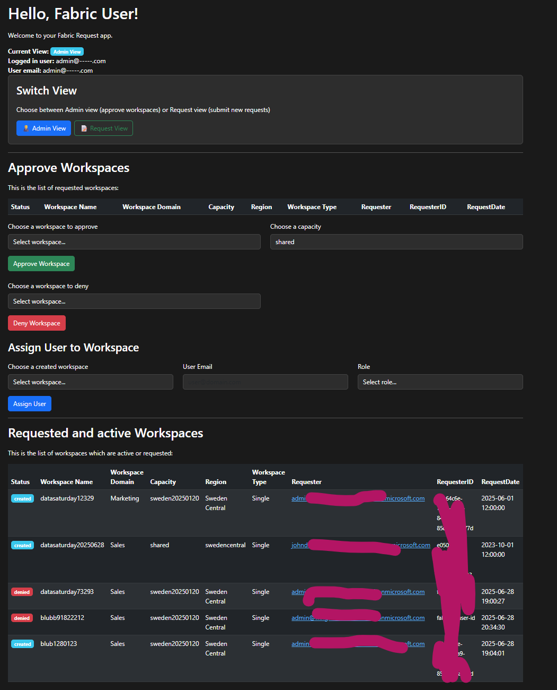
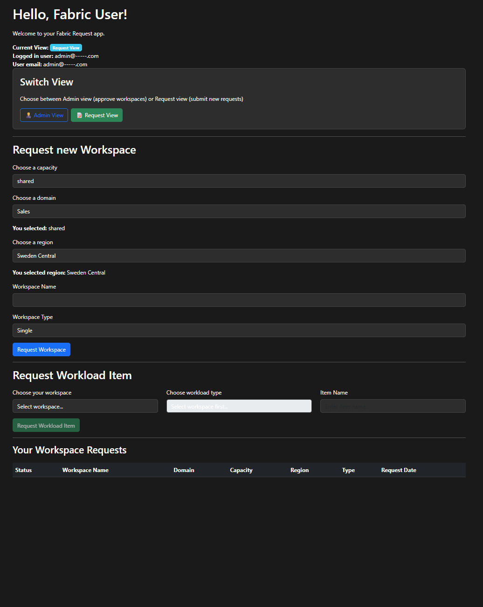

# Microsoft Fabric Management Portal

A FastAPI-based web application for managing Microsoft Fabric workspace requests, approvals, and workload item creation with role-based access control.

## Features

### 🏢 Workspace Management
- **Request Workspaces**: Users can submit requests for new Microsoft Fabric workspaces
- **Admin Approval**: Administrators can approve or deny workspace requests
- **Automatic Creation**: Approved workspaces are automatically created in Microsoft Fabric
- **Status Tracking**: Real-time tracking of workspace request status

### 👥 User Management
- **Role Assignment**: Assign users to workspaces with specific roles and privileges
- **Role-Based Access**: Different roles grant different workload creation permissions
  - **Data Engineer**: lakehouse, datapipeline, notebook
  - **Data Scientist**: notebook, mlmodel
  - **Data Analyst**: notebook
  - **Data Engineer RTI**: lakehouse, datapipeline, notebook, dataflow

### 🔧 Workload Item Management
- **Eligibility-Based Creation**: Users can create workload items based on their assigned privileges
- **Direct Creation**: Eligible users can create items immediately
- **Approval Workflow**: Non-eligible users can request items for admin approval
- **Supported Workload Types**: lakehouse, notebook, datapipeline, mlmodel, dataflow

### 🔐 Authentication & Security
- **Azure Easy Auth Integration**: Seamless authentication with Azure Active Directory
- **Development Fallback**: Local development support with fallback authentication
- **JWT Token Processing**: Secure token validation and user information extraction

## Screenshots

### Admin View
The admin interface provides comprehensive workspace management capabilities including approval/denial of requests, user assignment, and workspace monitoring.



### Requester View  
The requester interface allows users to submit workspace requests and create workload items based on their assigned privileges and eligibility.



## Architecture

```
┌─────────────────┐    ┌─────────────────┐    ┌─────────────────┐
│   Web Browser   │────│   FastAPI App   │────│  Azure Fabric   │
│                 │    │                 │    │                 │
└─────────────────┘    └─────────────────┘    └─────────────────┘
                               │
                               │
                       ┌─────────────────┐
                       │  SQL Database   │
                       │   (Workspaces,  │
                       │   Users, Roles) │
                       └─────────────────┘
```

## Prerequisites

- Python 3.11+
- Microsoft Fabric capacity and workspace access
- Azure SQL Database or SQL Server
- Azure Active Directory app registration (for authentication)
- ODBC Driver 18 for SQL Server

## Installation

### Local Development

1. **Clone the repository**
   ```bash
   git clone <repository-url>
   cd fabricrequestportalv2
   ```

2. **Create virtual environment**
   ```bash
   python -m venv venv
   source venv/bin/activate  # On Windows: venv\Scripts\activate
   ```

3. **Install dependencies**
   ```bash
   pip install -r requirements.txt
   ```

4. **Set up environment variables**
   ```bash
   cp .env-sample .env
   # Edit .env with your actual values
   ```

5. **Run the application**
   ```bash
   uvicorn main:app --reload --host 0.0.0.0 --port 8000
   ```

### Docker Deployment

1. **Build the Docker image**
   ```bash
   docker build -t fabric-portal .
   ```

2. **Run with environment file**
   ```bash
   docker run -d \
     --name fabric-portal \
     --env-file .env \
     -p 8000:8000 \
     fabric-portal
   ```

3. **Or run with docker-compose**
   ```bash
   docker-compose up -d
   ```

## Environment Variables

Create a `.env` file based on `.env-sample` and configure the following variables:

### Azure Fabric Configuration
- `TENANT_ID`: Your Azure tenant ID
- `CLIENT_ID`: Azure app registration client ID
- `CLIENT_OBJECT_ID`: Azure app registration object ID
- `CLIENT_SECRET`: Azure app registration client secret

### Database Configuration
- `DB_SERVER`: SQL Server hostname
- `DB_NAME`: Database name

### Optional Configuration
- `SUBSCRIPTIONS`: Azure subscription IDs (comma-separated)
- `USER_ID`: Development fallback user ID
- `USER_MAIL`: Development fallback user email
- `offlinemode`: Set to 1 for offline development mode

## Database Schema

The application requires the following SQL tables:

### Workspaces Table
```sql
CREATE TABLE [dbo].[Workspaces] (
    Id INT IDENTITY(1,1) PRIMARY KEY,
    Status NVARCHAR(50),
    WorkspaceName NVARCHAR(100),
    WorkspaceId NVARCHAR(100),
    Domain NVARCHAR(100),
    Capacity NVARCHAR(100),
    Region NVARCHAR(50),
    WorkspaceType NVARCHAR(50),
    Requester NVARCHAR(100),
    RequesterID NVARCHAR(100),
    RequestDate DATETIME
);
```

### Eligibility Table
```sql
CREATE TABLE [dbo].[Eligibility] (
    Id INT IDENTITY(1,1) PRIMARY KEY,
    Eligibility NVARCHAR(50),
    ItemType NVARCHAR(50),
    WorkspaceId NVARCHAR(100),
    UserEmail NVARCHAR(100)
);
```

### Domains Table
```sql
CREATE TABLE Domains (
    domainId INT IDENTITY(1,1) PRIMARY KEY,
    domainName NVARCHAR(255) NOT NULL
);

INSERT INTO Domains (domainName) VALUES ('Sales'), ('Finance'), ('Marketing');
```

### Capacities Table
```sql
CREATE TABLE Capacities (
    capacityId NVARCHAR(50) PRIMARY KEY,
    capacityName NVARCHAR(105) NOT NULL,
    region NVARCHAR(30)
);
```

## Azure Configuration

### App Registration Setup
1. Create an Azure App Registration
2. Configure API permissions for Microsoft Fabric
3. Create a client secret
4. Note the client ID, tenant ID, and object ID

### Easy Auth Configuration (for Azure App Service)
1. Enable Easy Auth in Azure App Service
2. Configure Azure Active Directory provider
3. Set authentication behavior to "Require authentication"

## Security Considerations

- **Environment Variables**: Never commit `.env` files to version control
- **Client Secrets**: Rotate client secrets regularly
- **Database Access**: Use Azure AD authentication for database connections
- **HTTPS**: Always use HTTPS in production
- **User Input**: The application includes basic input validation

## Development

### Project Structure
```
├── main.py                 # FastAPI application and routes
├── sqlconnection.py        # Database connection and queries
├── templates/
│   └── index.html         # Web interface template
├── static/                # Static files (CSS, JS, images)
├── requirements.txt       # Python dependencies
├── Dockerfile            # Docker container configuration
├── docker-compose.yml    # Docker Compose configuration
├── .env-sample          # Environment variables template
├── .gitignore           # Git ignore rules
└── README.md           # This file
```

### Adding New Features
1. Add new routes in `main.py`
2. Update database schema in `sqlconnection.py`
3. Modify UI in `templates/index.html`
4. Update API documentation in this README

## Troubleshooting

### Common Issues

1. **Database Connection Errors**
   - Verify ODBC Driver 18 is installed
   - Check database server and credentials
   - Ensure Azure SQL firewall allows connections

2. **Authentication Issues**
   - Verify Azure App Registration configuration
   - Check Easy Auth setup in Azure App Service
   - Use debug endpoints to troubleshoot token issues

3. **Fabric API Errors**
   - Verify client has appropriate Fabric permissions
   - Check tenant ID and client credentials
   - Ensure capacity exists and is accessible


## Contributing

1. Fork the repository
2. Create a feature branch
3. Make your changes
4. Test thoroughly
5. Submit a pull request

## License

This project is licensed under the MIT License - see the LICENSE file for details.

## Support

For issues and questions:
1. Check the troubleshooting section
2. Review debug endpoints output
3. Check application logs
4. Open an issue in the repository
